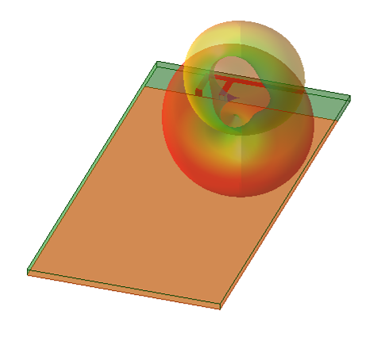
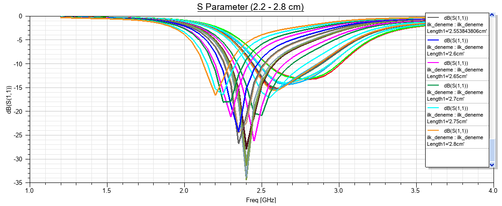
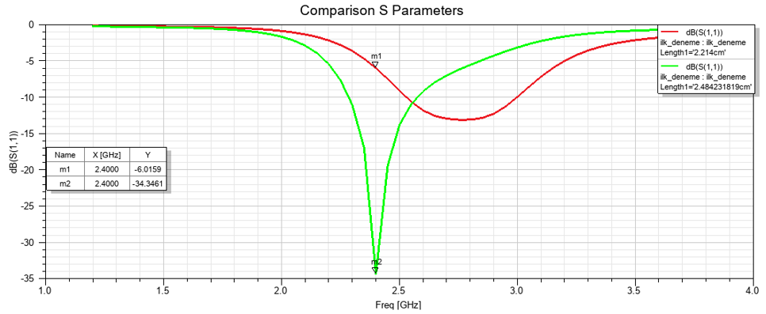
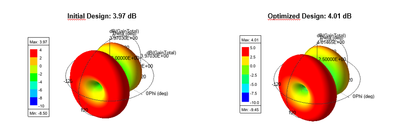

# 2.4 GHz PIFA Design and Optimization in Ansys HFSS



## 📌 Project Overview

This repository contains the complete design, high-frequency electromagnetic simulation, and performance optimization of a Planar Inverted-F Antenna (PIFA). Developed as part of the Numesys High Frequency Electromagnetics Training Camp, the project focuses on achieving precise impedance matching and optimal radiation characteristics for 2.4 GHz ISM band applications (such as Wi-Fi and Bluetooth).

The core objective was to tune the resonant frequency exactly to 2.4 GHz with a Return Loss (S11) of ≤ -25 dB and a directivity/gain of approximately 4 dB.

## 🛠️ Design Specifications

* **Operating Frequency:** 2.4 GHz
* **Substrate Material:** Custom dielectric with relative permittivity (εr) = 2.2
* **Conductor Material:** Perfect Electric Conductor (PEC)
* **Excitation:** 50 Ohm Lumped Port
* **Analysis Type:** Driven Modal (Modal Network)
* **Boundary Conditions:** Radiation boundary via 3D vacuum bounding box

## ⚙️ Optimization Methodology

The optimization primarily focused on adjusting the electrical length of the antenna (`Length1`). 

1. **Parametric Analysis:** A broad sweep of `Length1` from 2.2 cm to 2.8 cm (with 0.05 cm steps) was conducted to observe the resonance shift.
2. **Derivative Tuning:** Analytic Derivatives were utilized for real-time tuning without waiting for full simulation cycles.
3. **SNOPT Algorithm:** Applied for precise, goal-oriented optimization to lock the center frequency exactly at 2.4 GHz.

### Parametric Sweep Results



## 📊 Final Results: Initial vs. Optimized Design

The dimension optimization successfully shifted the resonant frequency and drastically improved the impedance matching, while preserving the wide-angle radiation characteristics and slightly increasing the peak realized gain.

### 1. Return Loss (S11) Performance

* **Initial Design (Length = 22.14 mm):** Resonated at 2.736 GHz. S11 at 2.4 GHz was -6.01 dB.
* **Optimized Design (Length = 24.84 mm):** Perfect resonance at 2.4 GHz. S11 improved to **-34.34 dB**.



### 2. Radiation Pattern & Gain

* **Initial Peak Gain:** 3.97 dB
* **Optimized Peak Gain:** **4.01 dB**



## 🚀 Usage & Simulation

1. **Clone this repository:**

```bash
git clone https://github.com/envergokaycay/2.4GHz-PIFA-Antenna/
```

2. Open **Ansys HFSS**  
   *(This project was created using Ansys 2025 R2 Student version.)*

3. Open the project file:

```
PIFA_antenna.aedt
```

4. Run the simulation:

```
Simulation → Analyze All
```

This will execute the interpolating frequency sweep and allow you to view the field reports.

Developed by Enver Gökay ÇAY  | email: envrcy@gmail.com
